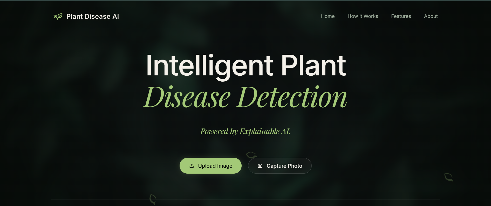
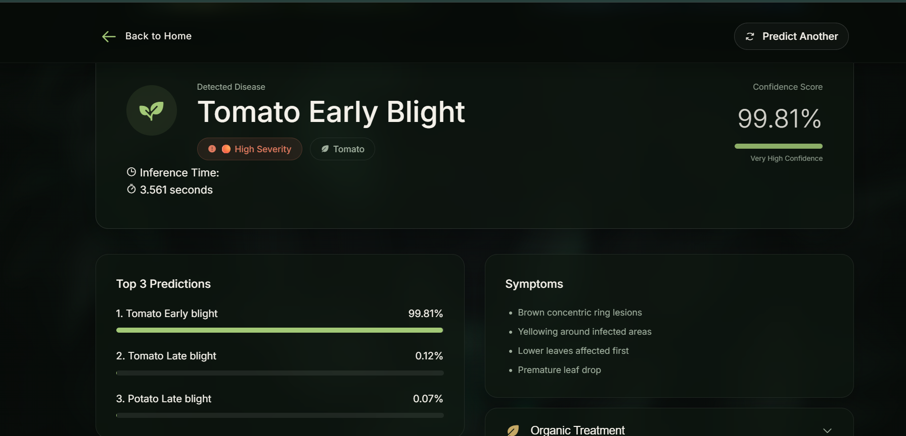
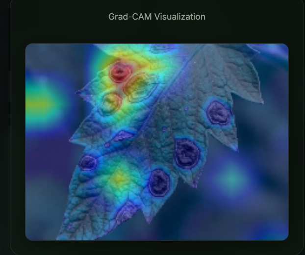

# 🌿 Plant Disease AI

An AI-powered web application for plant disease detection using **Transfer Learning (ResNet50)** and **Grad-CAM Explainability**.

The application allows users to upload or capture an image of a plant leaf and instantly receive:

- Disease prediction
- Confidence score
- Top 3 predictions
- Disease information
- Symptoms
- Cause
- Prevention
- Organic treatment
- Chemical treatment
- Grad-CAM visualization showing which regions of the leaf influenced the prediction.

---

# 📌 Overview

Plant diseases significantly reduce crop yield and quality. Early identification enables timely treatment and prevents further spread.

This project uses a deep learning model trained on the **PlantVillage Dataset** to classify plant diseases across **38 classes** and presents the prediction through an intuitive Flask web application.

Unlike many traditional plant disease classifiers, this project also integrates **Grad-CAM Explainable AI**, allowing users to visualize which parts of the leaf contributed most to the prediction.

---

# ✨ Features

- 🌿 Detects 38 plant diseases
- 🧠 Transfer Learning using ResNet50
- 📷 Upload image or capture using device camera
- 📊 Confidence score
- 🥇 Top 3 predictions
- 🔥 Grad-CAM Explainability
- 📖 Disease knowledge database
- 🩺 Symptoms
- ⚠️ Cause
- 🌱 Prevention methods
- 🍃 Organic treatments
- 🧪 Chemical treatments
- 📱 Responsive web interface
- 🎨 Modern UI with animations

---

# 🧠 Model Architecture

Model Backbone

- ResNet50 (ImageNet Pretrained)

Input Size

- 224 × 224 × 3

Transfer Learning

- Frozen ResNet50 base
- Global Average Pooling
- Dense Layer
- Dropout
- Softmax Output Layer

Framework

- TensorFlow 2.x
- Keras

Explainability

- Grad-CAM

---

# 📂 Dataset

Dataset Used:

PlantVillage Dataset

Number of Classes:

38

Dataset contains healthy and diseased leaves of multiple crops including:

- Apple
- Blueberry
- Cherry
- Corn
- Grape
- Orange
- Peach
- Pepper
- Potato
- Raspberry
- Soybean
- Squash
- Strawberry
- Tomato

The model was trained using only the RGB (Color) images from the PlantVillage dataset.

---

# 🛠️ Tech Stack

## Frontend

- HTML5
- CSS3
- JavaScript

## Backend

- Python
- Flask

## AI / Machine Learning

- TensorFlow
- Keras
- ResNet50
- OpenCV
- NumPy
- Pillow

---

# 📊 Results

The application provides:

- Predicted disease
- Confidence score
- Top 3 predictions
- Grad-CAM visualization
- Disease information
- Treatment recommendations

---

# 📸 Screenshots

### Landing Page




---

### Prediction Result




---

### Grad-CAM Visualization



---

# ⚠️ Model Limitations

This model performs well on images that are similar to the training dataset.

Best results are obtained when:

- Single leaf is visible
- Leaf occupies most of the image
- Good lighting conditions
- Plain or simple background
- Disease symptoms are clearly visible
- Image is in focus

The model may perform poorly when:

- Multiple leaves are present
- Background is cluttered
- Image is blurry
- Lighting is very poor
- Disease symptoms are extremely small
- Disease is not included among the 38 trained classes
- Different crop species not present in the training dataset
- Severe occlusion or partially visible leaves

This project is intended for educational and research purposes and should not replace professional agricultural diagnosis.

---

# 🚀 How to Run

## Clone Repository

```bash
git clone https://github.com/YOUR_USERNAME/Plant-Disease-AI.git

cd Plant-Disease-AI
```

## Install Requirements

```bash
pip install -r requirements.txt
```

## Run

```bash
python app.py
```

Open:

```
http://127.0.0.1:5000
```

---

# 📁 Project Structure

```
Plant Disease AI
│
├── models/
│      best_model.keras
│      class_names.json
│
├── static/
│      css/
│      uploads/
│      gradcam/
│
├── templates/
│      index.html
│      result.html
│
├── utils/
│      predictor.py
│      gradcam.py
│      disease_info.py
│      image_utils.py
│      helpers.py
│
├── app.py
├── requirements.txt
└── README.md
```

---

# 🔮 Future Improvements

- Improve performance on real-world field images
- Add multilingual support
- Deploy cloud-hosted inference
- Support additional plant species
- Disease severity estimation
- Real-time video detection
- Mobile application
- User history and analytics

---

# 👩‍💻 Author

**Modhura Banerjee**

---

# 📜 License

This project is released under the MIT License.

---
